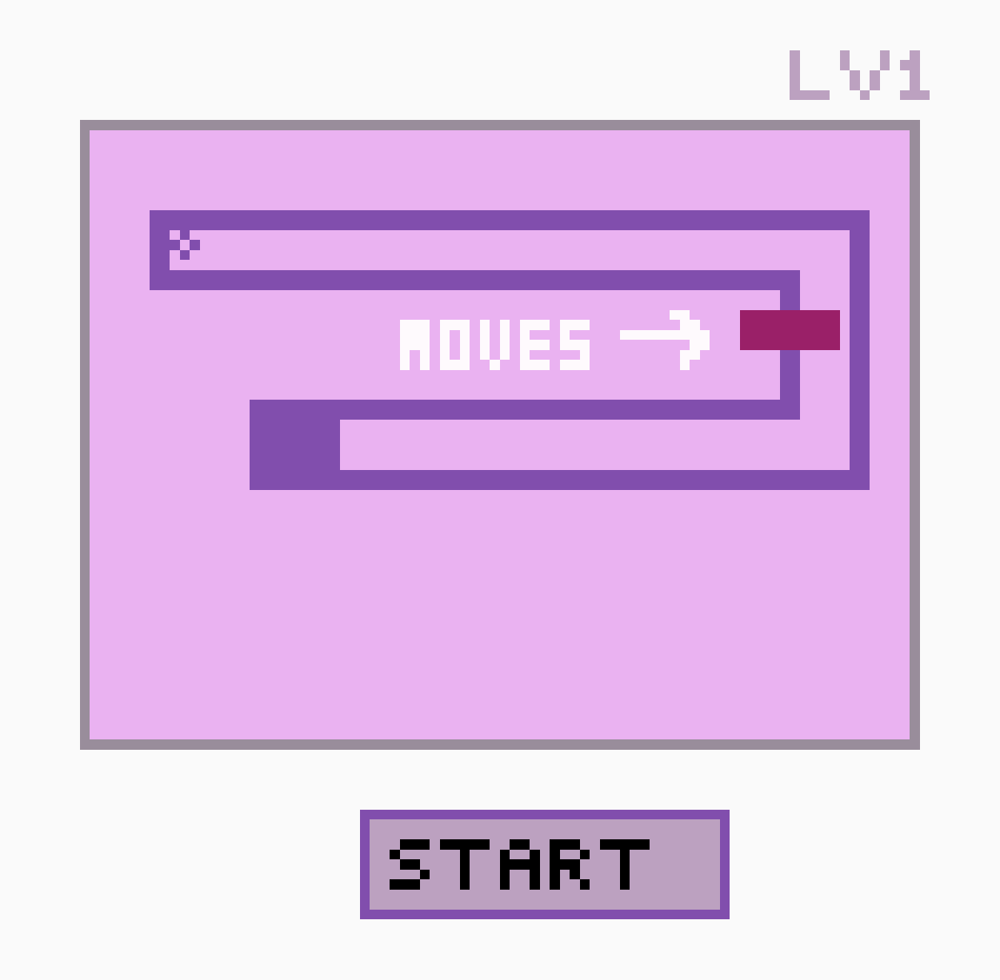

# Best Maze Game Ever!!

## Storyline:

YOU'RE A BALL! No seriously...you're a ball. Maybe not in real life BUT you will have to become one with the ball if to want win this game. All you have to do to win is drag the ball to the finish line! Seems simple enough. Oh, I forgot to mention there will be obstacles along the way. NO WOOOORRRIIIESS I know you can summon your inner Neo and dodge them like a champ!

## Game Layout:

### What is going into the game? 
Tech Stack = HTML, CSS, JavaScript (Mix of DOM and Canvas APIs)

## MVPs:
1. Page with start button prior to loading game unless clicked
1. After click load maze and instructions (dont forget obstacle)
1. On hover allow user to drag ball within the maze 
1. Once maze is complete load next level and repeat steps 1-3 until no more levels left

## Stretch Goals:
* Add a reset button
* include lvl number
* add surprise on completion
* maybe at small animations on background

## Potential RoadBlocks:
* having obstacle code not work
* breaking code if too many things are going on at once 
* using longer scripts instead of shortcuts when applicable 
* Problem solving/converting ideas into code

